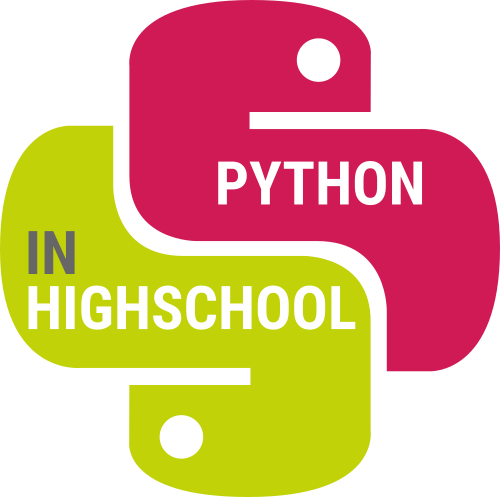

Python in high school - volume 1
================================

Python is the ideal language to learn programming.
It is a powerful language that will allow you to dive into the world of algorithms. 

This book guides you step by step through original mathematical and computer activities adapted to the high school. It is complemented by online resources: color chapters and the full codes. You have everything you need to succeed!

Book
====

The book is on sale on Amazon at cost price:

* [Amazon.com](https://www.amazon.com/dp/B085RQRSHL)
* [Amazon.ca](https://www.amazon.ca/dp/B085RQRSHL)
* [Amazon.uk](https://www.amazon.co.uk/dp/B085RQRSHL)
* [Amazon.fr](https://www.amazon.fr/dp/B085RQRSHL)

You can also download it from this site: 
[Book "Python in high school" (3 Mo)](book-python1.pdf).

Activities
==========

* Hello world [Activities](hello_world/hello_world.pdf)
* Turtle (Scratch with Python) [Activities](turtle/turtle.pdf)
* If ... then ... [Activities](ifthen/ifthen.pdf)
* Functions [Activities](functions/functions.pdf)
* Arithmetic -- While loop -- I [Activities](while/while-1.pdf)
* Strings -- Analysis of a text [Activities](strings/strings.pdf)
* Lists I [Activities](lists/lists-1.pdf)
* Statistics -- Data visualization [Activities](statistics/statistics.pdf)
* Files [Activities](files/files.pdf)
* Arithmetic -- While loop -- II [Activities](while/while-2.pdf)
* Binary I [Activities](binary/binary-1.pdf)
* Lists II [Activities](lists/lists-2.pdf)
* Binary II [Activities](binary/binary-2.pdf)
* Probabilities -- Parrondo's paradox [Activities](proba/proba.pdf)
* Find and replace [Activities](find/find.pdf)
* Polish calculator -- Stacks [Activities](stacks/stacks.pdf)
* Text viewer -- Markdown [Activities](markdown/text_markdown.pdf)
* L-systems [Activities](lsystems/lsystems.pdf)
* Dynamic images [Activities](images/images.pdf)
* Game of life [Activities](life/life.pdf)
* Ramsey graphs and combinatorics [Activities](ramsey/ramsey.pdf)
* Bitcoin [Activities](bitcoin/bitcoin.pdf)
* Random blocks [Activities](blocks/blocks.pdf)

Guides
======

* Python survival guide [Guide](guide/guide-python.pdf)
* Main functions [Guide](guide/guide-functions.pdf)
* Notes and references [Guide](guide/guide-biblio.pdf)

Codes
=====

You can find the source files by browsing the [GitHub project](https://github.com/exo7math/python1-en-exo7)

All the codes are grouped here: [Python Code](code/code.pdf)

Contribute
==========

If you find any error or want to improve the translation, feel free to contact me!

Author
======

Arnaud Bodin

Acknowledgements to: Stéphanie Bodin, Michel Bodin, François Recher, Éric Wegrzynowski, Philippe Marquet, Kroum Tzanev.

The English version of the book as been translated:

* using [DeepL](https://www.deepl.com/)
* and a homemade tool [GitHub arnbod](https://github.com/arnbod)
* followed by a careful reading by Emily Gubski.

This book is distributed under the license *Creative Commons -- BY-NC-SA -- 4.0*.
